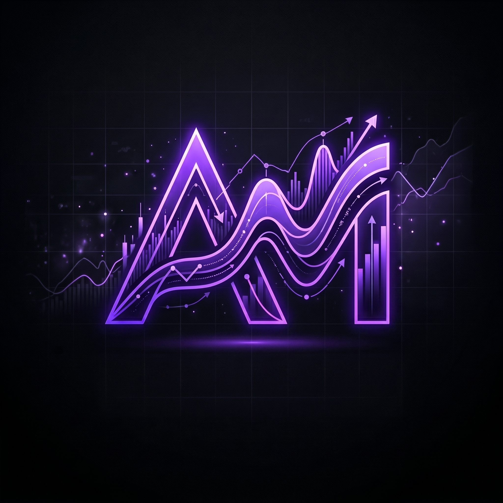
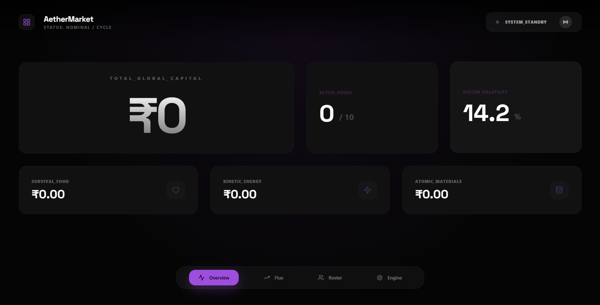
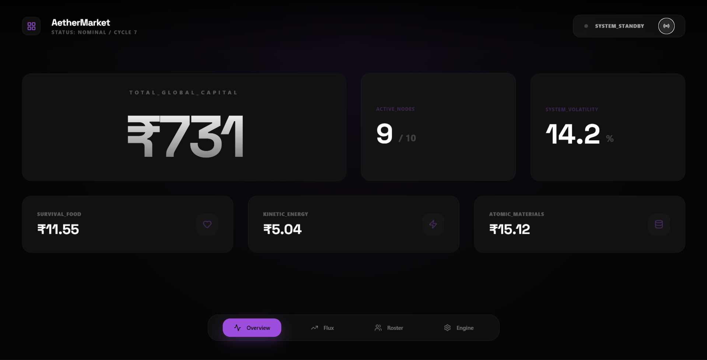
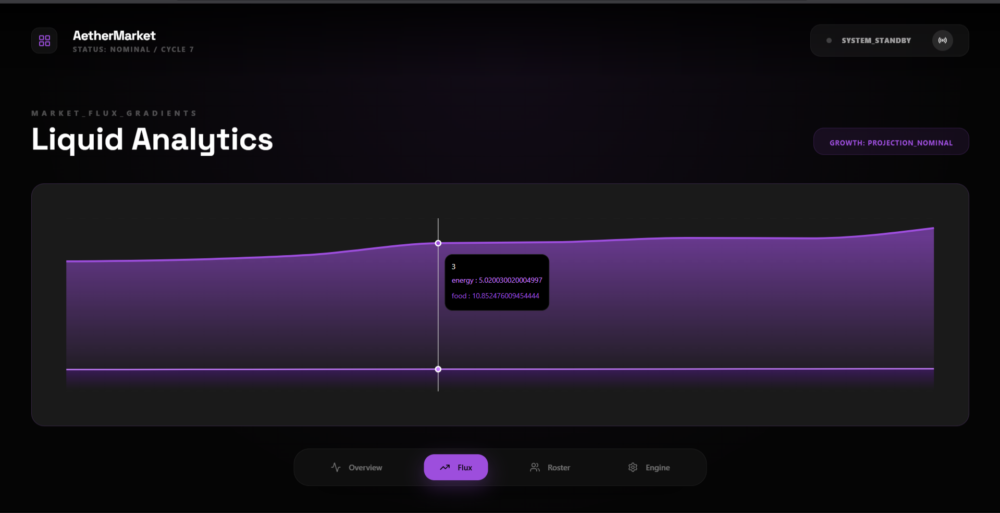
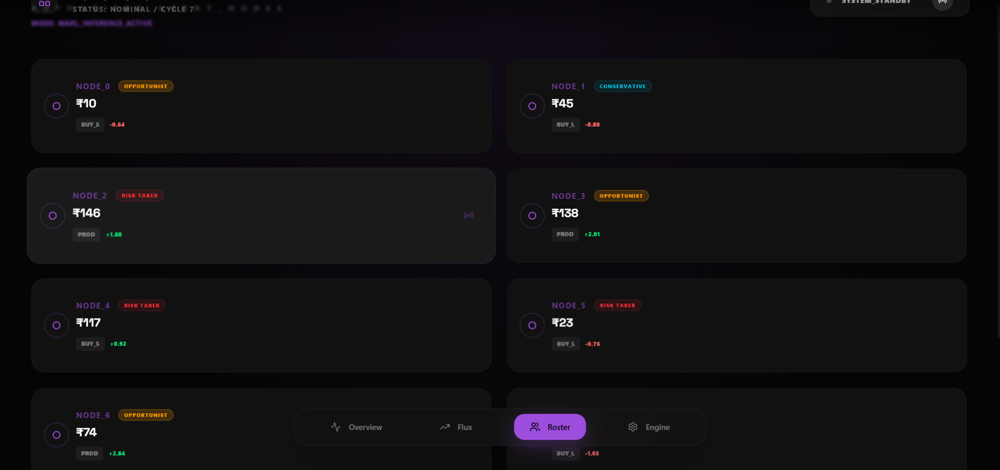
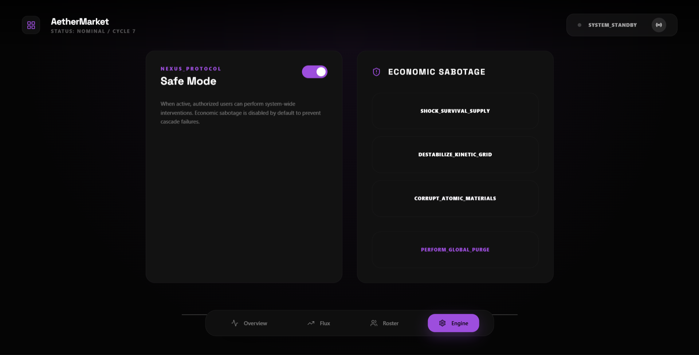
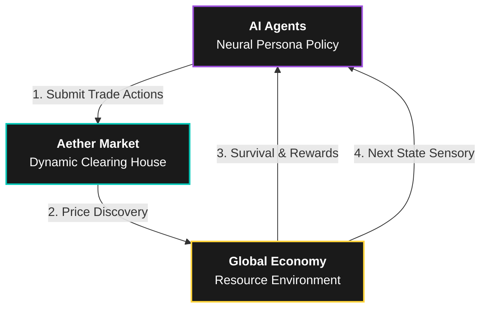

<div align="center">
  
  <h1>AetherMarket 🚀 (v12.1)</h1>
  <p><b>Heterogeneous Multi-Agent Reinforcement Learning Arena</b></p>
  
  [](https://www.python.org/)
  [](https://en.wikipedia.org/wiki/Reinforcement_learning)
  [](https://pettingzoo.farama.org/)
  [](https://reactjs.org/)
  [](https://fastapi.tiangolo.com/)
  [](https://stable-baselines3.readthedocs.io/)
  <br />
  [](https://tailwindcss.com/)
  [](https://www.typescriptlang.org/)
</div>

---

## 🌟 Overview

**AetherMarket** is a high-fidelity economic laboratory where agents with unique neural identities engage in emergent trade, production, and survival. It transitions from monolithic agent behaviors to a complex, diverse social ecosystem driven by divergent survival strategies.

## 🖼️ Neural Interface Gallery

<div align="center">
  
  
  <br />
  
  
  <br />
  
</div>

## 🕹️ How it Works (The Workflow)



Imagine a tiny digital city with **10 smart agents**. To survive, they must manage their money and food. They watch a live **Market** where prices go up and down based on their own actions. 
1. **Agents make a choice**: Buy, Sell, or Wait.
2. **The Market reacts**: If everyone buys, prices skyrocket. If everyone sells, the market crashes.
3. **The AI learns**: Every time an agent makes a good trade, it gets a "reward" and becomes smarter for the next round.

## 🚀 Hard Metrics & Analysis (Phase 3)

- **📈 Inequality Monitoring**: Live tracking of the **Gini Coefficient** to study wealth concentration patterns.
- **☣️ Market Health Forensics**: Real-time **Volatility Indexing** and automated **Crash Detection** algorithms.
- **🚨 Contagion Propagation (Phase 5)**: 
    - **Cascading Failures**: A crash in one resource (e.g., Energy) triggers downward price pressure across the entire ecosystem.
    - **Interdependency Engine**: Complex resource-coupling logic simulating global economic panic.
    - **Red Alert Interface**: High-intensity CRT glitch visuals and system-wide alarms during contagion loops.
- **📉 Demographic Survival**: Live **Survival Rate** tracking showing population decay over the simulation cycle.
- **📊 Wealth Distribution**: High-fidelity histograms visualizing the capital spread across different neural personas.

## 🧠 The Mission: What are we learning?
We are here to **prove that decentralized AI agents can learn, compete, and create complex economic behavior without any central control.** By watching how specialized personalities—like a Risk-Taker or a Careful Trader—handle scarcity and greed, we unlock secrets of emergent intelligence.

## 🏆 The Ultimate Goal
To build a high-fidelity **sandbox to study emergent intelligence in economic systems.** A safe, digital laboratory where we can observe how life-like market behaviors evolve naturally from autonomous neural policies. 

## 📂 Project Structure

```
aether-market/
├── backend/
│   ├── api/            # FastAPI & WebSocket Telemetry
│   ├── engine/         # MARL Environment (RL_Env) & Market Logic
│   └── models/         # Trained Neural Policy Weights (.zip)
├── frontend/           # Vite + React + Tailwind Dashboard
│   ├── src/            # Core UI Logic & Diagnostic Components
│   └── public/img      # Brand Assets & UI Icons
└── shared/             # Standardized schemas and protocols
```

## 🛠️ Setup & Execution

### 1. Backend Orchestration
```bash
cd backend
pip install -r requirements.txt
python api/main.py
```

### 2. Frontend Interface
```bash
cd frontend
npm install
npm run dev
```


---

### 👨‍💻 Author
**Rudranarayan aka Levvizz18**

---
*Built for the study of Emergent Intelligence and Heterogeneous Behavioral Finance.*
